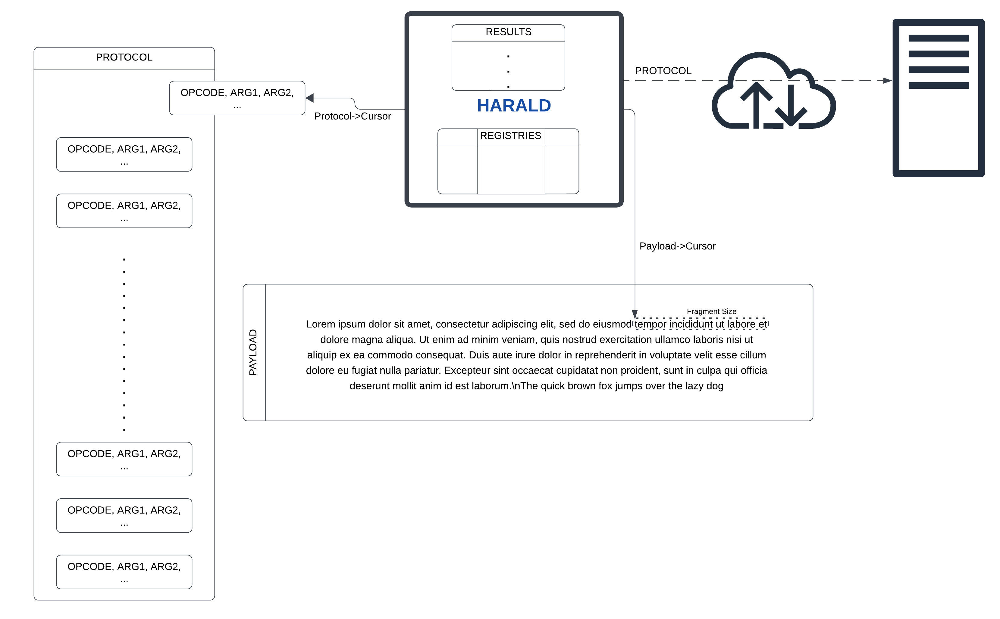

# Harald CPU

Harald is an in-memory tiny high-level CPU, able to process a set of instructions to
generate **application-layer** protocols to be used over a given network
protocol (TCP/UDP).

Harald will consume a stream of _OPCODES_ and apply different transformations to
the payload for it to be suitable for the defined application-layer protocol.

> [!TIP]
> Why _Harald_? You may know Harald Gormsson, king of Denmark,
> for his nickname: _Blátǫnn_, or how we pronounce it nowadays, **Bluetooth**.
> The technology was named after Harald's nickname as he _connected_ the Danish
> and Viking kingdoms back then. So I'm naming this after his firstname.

## Diagram

Harald behaves as a CPU. It follows a set of OPCODES that define actions.
A PROTOCOL. Harald will process the required operations to create the required
protocol on the fly.

Once the PROTOCOL is provided, Harald will iterate over the PAYLOAD to be sent
by traversing the entire PROTOCOL once for every fragment. I.e.: If the payload
had to be split in multiple fragments, Harald will use the same protocol for
every fragment, executing every action defined in the protocol against the
current payload fragment.

Harald holds a number of registries to be used by the protocol to store values.
These registries can be used to perform multiple operations, such as addition,
substraction, encoding and decoding... etc.

Harald dynamically allocates an array of results where the protocol can store
the responses to each request performed upon sending a payload fragment.



## Opcodes

Harald supports a variety of Opcodes to be provided as a protocol. Harald will
perform a set of high-level operations upon receiving a given Opcode. Each
Opcode expects a predefined set of arguments with a predefined length.

|          OPCODE::Nº           | Description                                                                  | ARGS::Size                                          |
| :---------------------------: | ---------------------------------------------------------------------------- | --------------------------------------------------- |
|       H_F_APPEND::0x01        | Appends the following N Bytes to the end payload                             | Size::4, NBytes::N                                  |
|       H_F_PREPEND::0x02       | Prepends the following N Bytes to the end payload                            | Size::4, NBytes::N                                  |
|        H_F_SPLIT::0x03        | Splits the Payload in fragments of the given size                            | Size::4                                             |
|   H_F_PAYLOAD_INJECT::0x04    | Injects the Payload fragment into the End Payload                            | -                                                   |
|      H_F_SOCK_INIT::0x05      | Initializes the socket connection                                            | IsIPAddress:1, SSL_Enabled::1, TCP/UDP::1, [(HostLen::4,HostName:N)/IPAddress::4], Port::2 |
|        H_F_SEND::0x06         | Sends the constructed End Payload                                            | -                                                   |
|        H_F_RECV::0x07         | Receives up to N Bytes                                                       | Size::4                                             |
|        H_F_CLOSE::0x08        | Closes the socket and cleans                                                 | -                                                   |
|       H_F_INJECT::0x09        | Injects the requested registry into the End Payload                          | Reg::1                                              |
|     H_F_ENCODE_STR::0x0A      | Encodes a Payload field to its string representation                         | IsReg::1, [(Payload::1, Field::1)/Reg::1], Format::1|
|     H_F_DECODE_STR::0xA0      | Decodes the contents of a registry to its numeric representation             | Reg::1                                              |
|    H_F_ENCODE_STRB64::0x0B    | Encodes a Payload field to its B64string representation                      | Payload::1, Field::1                                |
| H_F_COMPUTE_FRAG_LENGTH::0x0D | Calculates the next fragment to be sent length                               | -                                                   |
|       H_F_SEARCH::0x0E        | Searches for a given byte pattern of a given N size in a given registry      | Reg::1, Size::4, NBytes::N                          |
|        H_F_SEEK::0x0F         | Moves the cursor in a given payload by a given number of bytes               | Payload::1, Offset::4                               |
|        H_F_PUSH::0x10         | Pushes a number of bytes or the contents of a registry into another registry | IsReg::1, [Size::4, NBytes::N]/SrcReg::1, DstReg::2 |
|         H_F_ADD::0x12         | Adds two registries or a number to a registry                                | IsReg::1, [Size::4, NBytes::N]/SrcReg::1, DstReg::2 |
|      H_F_SUBSTRACT::0x13      | Substracts two registries or a number to a registry                          | IsReg::1, [Size::4, NBytes::N]/SrcReg::1, DstReg::2 |
|        H_F_READ::0x14         | Reads from a given registry up to the length stored in another registry      | FromReg::1, SizeReg::1                              |
|        H_F_STORE::0x15        | Stores a registry value into Harald's Storage                                | Reg::1                                              |


## HTTP Example

The following Opcode stream will generate the required data to be sent for a
communication be understood as HTTP. It will initiate, modify the payload to
look like HTTP traffic, send it over an SSL/TLS connection, and close the
connection at the end.

```c
H_F_SPLIT, 0x00, 0x00, 0x00, 0xFF,                         // Splits the Payload
H_F_APPEND, 0x00, 0x00, 0x00, 0x46,                           // Appends...
  'P', 'O', 'S', 'T', ' ', '/', ' ',                              // POST / 
  'H', 'T', 'T', 'P', '/', '1', '.', '1', '\r', '\n',             // HTTP/1.1
  'H', 'o', 's', 't', ':', ' ',                                   // Host: 
    'd', 'o', 'm', 'a', 'i', 'n', '.', 'c', 'o', 'm', '\r', '\n', // domain.com
  'C', 'o', 'n', 'n', 'e', 'c', 't', 'i', 'o', 'n', ':', ' ',     // Connection: 
    'c', 'l', 'o', 's', 'e', '\r', '\n',                          // close
  'C', 'o', 'n', 't', 'e', 'n', 't', '-',                         // Content-
    'L', 'e', 'n', 'g', 't', 'h', ':', ' ',                       // Length: 
H_F_COMPUTE_FRAG_LENGTH,                                 // Next Fragment's size
H_F_ENCODE_STR, H_PAY_END_PAYLOAD, H_PAY_FRAGMENT_SIZE, 'u',  // FragSize encode
H_F_INJECT, H_REG_RET,                   // Inject the Fragment Size encoded str
H_F_APPEND, 0x00, 0x00, 0x00, 0x04, '\r', '\n', '\r', '\n', // Append Body begin
H_F_PAYLOAD_INJECT,                                        // Inject the Payload
H_F_SOCK_INIT, 0x01, 0x01, 0x7F, 0x00, 0x00, 0x01, 0x04, 0xD2,    // Init Socket
H_F_SEND,                                    // Send the Payload over the socket
H_F_CLOSE                                        // Close the socket and cleanup 
```

1. Split (0x03) the payload in blocks of up to 0x000000FF Bytes.
2. Append (0x01) the next 0x00000046 Bytes. (POST / HTTP/1.1\r\nHost: domain...)
3. Calculate fragment length (0x0D).
4. Encode (0x0A) the fragment size information (uint) from the payload as a
   string.
5. Inject (0x09) the information in the return (H_REG_RET) registry.
6. Append (0x01) the next 0x00000004 Bytes. (\r\n\r\n)
7. Inject the payload (0x04)
8. Initialize the Socket (0x05) using SSL/TLS, to connect to a TCP socket to the
   IP address defined in the following 4 Bytes (0x7F000001), and to the port
   defined in the following 2 Bytes (0x04D2).
9. Send (0x06) the payload.
10. Close (0x08) the connection.


## HTTPS Example Using the GitHub API

The following example follows the same procedures as the previous one. However,
instead of just sending the payload as the body, the Protocol will instruct
Harald to set up some headers and structure the body so it can communicate with
the GitHub API to publish comments in a private repository's issue. 

This kind of communication may help an attacker to create a communication
channel with the C2 server using a trusted domain, like *.github.com. This very
same example could be extrapolated to use AWS resources (like SQS queues under
sqs.<region>.amazonaws.com), Azure resources (like blobs under
<storage_account_name>.blob.core.windows.net) and so on. 

This example is a good reference for those communications that require a
STRUCTURED_FORMAT (JSON) + APPLICATION-LAYER_PROTOL (HTTPS) + PROTOCOL (TCP).


```c
H_F_SPLIT, 0x00, 0x00, 0x00, 0xFF,
H_F_APPEND, 0x00, 0x00, 0x01, 0x85, 'P','O','S','T',' ',
'/','r','e','p','o','s','/','YOUR_GH_USER','/','YOUR_GH_REPO',
'/','i','s','s','u','e','s','/','ISSUE_NUMBER',
'/','c','o','m','m','e','n','t','s',' ',
'H','T','T','P','/','1','.','1','\r','\n', 'H','o','s','t',':','
','a','p','i','.','g','i','t','h','u','b','.','c','o','m','\r','\n',
'A','u','t','h','o','r','i','z','a','t','i','o','n',':',' '
,'B','e','a','r','e','r',' ','g','i','t','h','u','b','_','p','a','t','_',
'YOUR_GH_PAT','\r','\n',
'X','-','G','i','t','H','u','b','-',
'A','p','i','-','V','e','r','s','i','o','n',':','
', '2','0','2','2','-','1','1','-','2','8','\r','\n',
'U','s','e','r','-','A','g','e','n','t',':','
','H','a','r','a','l','d','/','0','.','1','b','\r','\n',
'A','c','c','e','p','t',':','
','a','p','p','l','i','c','a','t','i','o','n','/',
'v','n','d','.','g','i','t','h','u','b','+','j','s','o','n','\r','\n',
'C','o','n','t','e','n','t','-','T','y','p','e',':',' ',
'a','p','p','l','i','c','a','t','i','o','n','/',
'x','-','w','w','w','-','f','o','r','m','-',
'u','r','l','e','n','c','o','d','e','d','\r','\n',
'C','o','n','n','e','c','t','i','o','n',':','
','c','l','o','s','e','\r','\n',
'C','o','n','t','e','n','t','-','L','e','n','g','t','h',':',' ',
H_F_COMPUTE_FRAG_LENGTH,
H_F_ADD, 0x00, 0x00, 0x00, 0x00, 0x01, 0x0B, H_REG_RET,
H_F_ENCODE_STR, 0x01, H_REG_RET, 'u',
H_F_INJECT, H_REG_RET,
H_F_APPEND, 0x00, 0x00, 0x00, 0x0D, '\r', '\n', '\r', '\n', '{', '"', 'b',
'o', 'd', 'y', '"', ':', '"',
H_F_PAYLOAD_INJECT,
H_F_APPEND, 0x00, 0x00, 0x00, 0x02, '"', '}',
H_F_SOCK_INIT, 0x00, 0x01, 0x01, 0x00, 0x00, 0x00, 0x0F, 
'a', 'p', 'i', '.',
'g', 'i', 't', 'h', 'u', 'b', '.', 'c', 'o', 'm', '\0', 0x01, 0xBB,
H_F_SEND,
H_F_CLOSE
```

1. Split (0x03) the payload in blocks of up to 0x000000FF Bytes.
2. Append (0x01) the next 0x00000185 Bytes. (POST /repos/... HTTP/1.1\r\n
   Host: domain...) This will include the headers for the GH API, like the
   Authorization, X-GitHubApi-Version, and so on.
3. Calculate fragment length (0x0D). The result is stored in the H_REG_RET
   registry.
4. Add (0x12) a value of length 0x00000001 0x0B to the H_REG_RET registry.
   This will account for the '{"body":""}' characters in the Content-Length
   header.
4. Encode (0x0A) the registry H_REG_RET as a string.
5. Inject (0x09) the information in the return (H_REG_RET) registry into
   the End Payload.
6. Append (0x01) the next 0x0000000D Bytes. (\r\n\r\n{"body":")
7. Inject the payload (0x04).
6. Append (0x01) the next 0x00000002 Bytes. ("})
8. Initialize the Socket (0x05) to connect to a domain using SSL/TLS over a
   TCP socket to the domain defined in the following 16 Bytes (0x0000000F)
   and to the port defined in the following 2 Bytes (0x01BB).
9. Send (0x06) the payload.
10. Close (0x08) the connection.


## Requirements

You'll need a compiler to build it. Such as GCC, Clang, or Microsoft's CL. Also, 
there are some libraries dependencies:

### Linux

Install LibSSL and pkg-config:

```
sudo apt install libssl-dev pkg-config
```

### OSX

Install OpenSSL via `brew` or build and configure it yourself. 

```
brew install openssl
``` 

### Windows

Get OpenSSL from any of their [linked distributors](https://wiki.openssl.org/index.php/Binaries) or build and configure it yourself.


## BUILD

The repository contains a [Makefile](Makefile) to build the library and some
test binaries.

To build the Harald library, run:

```bash
make lib
```

This will create a shared library `libharald.so`, `libharald.dll`, or
`libharald.dylib` depending on your platform.

To build the test binaries, run:

```bash
make test
```

This will create two binaries: `test_harald` and `test_harald_gh` (with their
respective extension, based on your platform).

## TEST

To test Harald's functionalities, run the provisioned servers
[socket_server_test.py](socket_server_test.py) and
[https_server_test.py](https_server_test.py). These, will create a socket and
HTTPS server respectively to be used by the test binaries.

> Note: You may need to set your `LD_LIBRARY_PATH` to the current folder: ```LD_LIBRARY_PATH=$LD_LIBRARY_PATH:. ./test_harald```

You'll be required to create an SSL/TLS certificate for HTTPS communication
(self-signed is fine). You can create one using OpenSSL with the following
command: 

```bash
openssl req -x509 -newkey rsa:4096 -keyout key.pem -out cert.pem -days 365
```

Once the servers are up and running, execute the `test_harald` binary:

```bash
./test_harald
```

The binary should connect to the provisioned servers and send the predefined
data payloads as specified in the protocol.


### Test GitHub API

To test the GitHub API functionalities, some preparations should take place
prior to run the `test_harald_gh` binary. 

Create a repository and an issue.

The [test_harald_gh.c](test_harald_gh.c) file contains a simple example of how
to use Harald to interact with the GitHub API to create comments in issues. It
requires you to have an access token for GitHub, which can be obtained from your
GitHub account settings under Developer settings -> Personal access tokens ->
Fine-grained tokens. It is recommended to fine-grain the token to only get
access to the newly created repository and to the `Read access to metadata` and
`Read and Write access to issues and pull requests` permissions.

To run properly, you'll be required to modify the placeholder values for:

- `YOUR_GH_USER`: Your GitHub username.
- `ISSUE_NUMBER`: The issue number on the repository where you want to interact
  with (e.g., "1" for the first issue in a repo).
- `YOUR_GH_REPO`: The name of the repository where you want to interact with
  (e.g., "harald").
- `YOUR_GH_PAT`: Your GitHub access token.

Once done, make sure to update the size of the payload sent to match your needs!

At [test_harald_gh.c#L9](test_harald_gh.c#L9), the 4th parameter of the
`H_F_APPEND` opcode stands for the size of the payload. You'll need to update
this value accordingly when you modify the payload structure.

Build the test binaries and run this one:

```bash
./test_harald_gh
```

This will create a comment in the provided issue.


# Acceptable Use Disclaimer

The source code contained in this repository can be used to evade network
filtering and reduce the risk of detection by security appliances. Before using
this source code, please ensure that your use is compliant with all applicable
laws in your jurisdiction.
